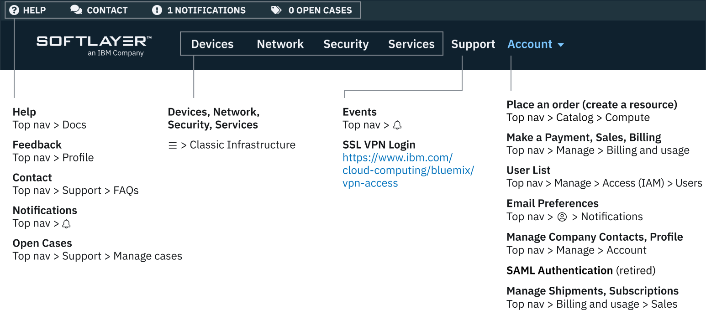

---

copyright:

  years: 2019

lastupdated: "2019-06-17"

keywords: SoftLayer account, IBM Cloud account, customer portal, console

subcollection: customer-portal 

---

{:shortdesc: .shortdesc}
{:codeblock: .codeblock}
{:tip: .tip}
{:screen: .screen}
{:external: target="_blank" .external}

# 轉換為 {{site.data.keyword.cloud_notm}} 體驗
{: #redirect-cloud}

在從 SoftLayer 移轉到 {{site.data.keyword.cloud}} 的過程中，請熟悉 {{site.data.keyword.cloud_notm}} 主控台，您將使用該主控台管理平台和基礎架構資源。我們目前處於鏈結所有 SoftLayer 和 {{site.data.keyword.cloud_notm}} 帳戶的程序中。因此，您的帳戶可能還沒有存取權。一旦有了存取權，您就可以開始新的體驗。請參閱下圖，以獲取有關您可在何處找到資源的詳細對映。  
{:shortdesc}

先前命名為 SoftLayer，現在稱為 {{site.data.keyword.cloud_notm}} 標準基礎架構。
{: tip}

主控台功能表列包含「功能表」圖示  以及下列鏈結： 

  * **型錄**：可用供應項目的集合。 
  * **文件**：{{site.data.keyword.cloud_notm}} 產品說明文件。 
  * **支援**：{{site.data.keyword.cloud_notm}} 支援中心。 
  * **管理**：帳戶、計費及用量以及 Identity and Access Management 選項的功能表。 
  * 「成本預估器」圖示：用於大致瞭解基礎架構可能需要的成本的工具。
  * 通知圖示：公告、規劃事件以及未規劃事件的存取權。

## 存取支援案例
{: #support-mng}

要存取現行支援案例，請按一下**支援** > **管理案例**。您還可以透過按一下**檢視保存案例**來存取保存案例。

## 提交意見回饋
{: #feedback-profile}

您可以提交好評、建議或任何其他意見。要與我們聯繫，請從下面的方法進行選擇：

  * 按一下位於主控台頁面邊緣的**意見**按鈕。 
  * 按一下**虛擬人像圖示**  > **意見**。 

## 下訂單
{: #place-order}

使用型錄下訂單。您可以使用下列某種方法導覽到型錄：

  * 按一下功能表列上的**型錄**。
  * 按一下**功能表圖示**  > **資源清單**。然後，按一下**建立資源**。

## 進行付款
{: #payments}

您可以從主控台的「計費及用量」區段進行支付。移至**管理 ** > **計費及用量**，然後選取**付款**。
 

## 存取業務項目
{: #sales}

您裝置的報價和升級、訂單、取消和裝運都在主控台的「計費及用量」區段中。移至**管理** > **計費及用量**，然後選取**業務**。 

## 存取計費項目
{: #billing-items}

您可以從主控台的「計費及用量」區段存取計費項目。移至**管理** > **計費及用量**，然後選取**計費項目**。

## 管理使用者和存取權
{: #billing-items}

您可以從主控台的「存取權 (IAM)」區段管理使用者的標準基礎架構存取權。移至**管理** > **存取 (IAM)**，然後選取**使用者**。有關更多詳細資料，請參閱[管理標準基礎架構存取權](/docs/iam?topic=iam-mngclassicinfra)。

## 尋找基礎架構項目
{: #sl-links}

按一下**功能表圖示**  > **標準基礎架構**以快速找到您的裝置、儲存空間、網路、安全和服務。 

  

